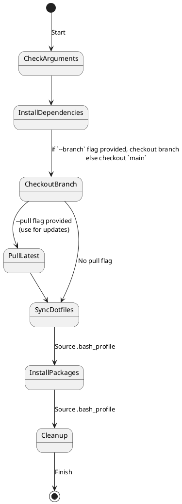

# Syncronised dotfiles

[A guide on dotfiles](https://dotfiles.github.io/)

[Inspired-by and built-upon](https://github.com/mathiasbynens/dotfiles)

## Overview



## Installation

**Warning:** If you want to give these dotfiles a try, you should first fork this repository, review the code, and remove things you don’t want or need.

### Pre-requisites

* curl
* git
* rsync
* bash

### Using Git and the bootstrap script

You can clone the repository wherever you want. (I like to keep it in `~/dot`) The bootstrapper script will pull in the latest version and copy the files to your home folder.

```bash
git clone <this/repo-url> ~/dot && cd ~/dot && source bootstrap.sh
```

### Add custom commands without creating a new fork

If `~/.extra` exists, it will be sourced along with the other files. You can use this to add a few custom commands without the need to fork this entire repository, or to add commands you don’t want to commit to a public repository.

eg.

```bash
# Git credentials
GIT_AUTHOR_NAME="Grant Rolls"
GIT_COMMITTER_NAME="$GIT_AUTHOR_NAME"
GIT_AUTHOR_EMAIL="my-email@email.com"
GIT_COMMITTER_EMAIL="$GIT_AUTHOR_EMAIL"

git config --global user.name "$GIT_AUTHOR_NAME"
git config --global user.email "$GIT_AUTHOR_EMAIL"
```

## Syncronising/Updating

```bash
cd ~/dot && source bootstrap.sh --pull
```

### To specify a branch (for scripted/devcontainer setups)

```bash
cd ~/dot && source bootstrap.sh --pull --branch <branch>
```